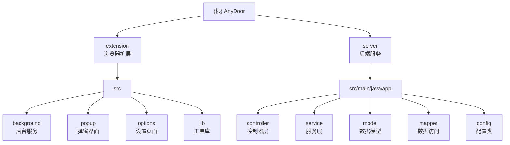

# AnyDoor - Token 共享浏览器插件

> 最小可行闭环：本人账号内跨设备共享 Cookie（上传 → 回写）

## 变更记录 (Changelog)

### 2025-11-13 13:02:14
- 初始化项目 AI 上下文文档
- 生成根级与模块级 CLAUDE.md
- 建立架构总览与模块索引

---

## 项目愿景

AnyDoor 是一个跨设备 Token（Cookie）共享解决方案，旨在为开发者和测试人员提供便捷的账号状态同步能力。通过浏览器扩展 + 后端服务的架构，实现：

- 一键上传当前站点的 Cookie 与 localStorage 状态
- 跨设备/浏览器通过 bundleId 快速回写，实现免登录访问
- 黑名单机制保护敏感 Cookie 不被上传
- 基于 Sa-Token 的账号隔离与鉴权

**适用场景：**
- 多设备开发环境同步
- 测试账号状态快速复现
- 临时登录态迁移

**注意：** 当前为 MVP 演示版本，仅用于开发环境，生产使用需完善 HTTPS、加密、审计等安全机制。

---

## 架构总览

### 技术栈

**前端（浏览器扩展）：**
- Manifest V3
- 纯 JavaScript（无构建链）
- Chrome Extension APIs（cookies、storage、tabs、scripting）

**后端服务：**
- Java 17 + Spring Boot 3.3.2
- Sa-Token 1.38.0（会话管理）
- MyBatis-Flex 1.10.9（数据持久化）
- Druid 1.2.23（数据库连接池）
- MySQL 8.x

### 系统架构

```
┌─────────────────────┐
│  浏览器扩展         │
│  ┌───────────────┐  │
│  │ Popup UI      │  │ ← 用户交互：上传/回写
│  └───────┬───────┘  │
│          │          │
│  ┌───────▼───────┐  │
│  │ Service Worker│  │ ← 核心逻辑：Cookie 采集/写入
│  └───────┬───────┘  │
│          │          │
│  ┌───────▼───────┐  │
│  │ Lib Modules   │  │ ← 工具库：API/Cookies/Storage
│  └───────────────┘  │
└─────────┬───────────┘
          │ HTTP/JSON
          │
┌─────────▼───────────┐
│  后端服务           │
│  ┌───────────────┐  │
│  │ Controllers   │  │ ← Auth/Bundle/Blacklist API
│  └───────┬───────┘  │
│          │          │
│  ┌───────▼───────┐  │
│  │ Services      │  │ ← 业务逻辑：Bundle/Crypto
│  └───────┬───────┘  │
│          │          │
│  ┌───────▼───────┐  │
│  │ Mappers/Repo  │  │ ← 数据访问层
│  └───────┬───────┘  │
│          │          │
│  ┌───────▼───────┐  │
│  │ MySQL         │  │ ← 持久化存储
│  └───────────────┘  │
└─────────────────────┘
```

---

## 模块结构图



---

## 模块索引

| 模块路径 | 语言 | 职责描述 | 入口文件 | 文档链接 |
|---------|------|---------|---------|----------|
| `/extension` | JavaScript | 浏览器扩展，负责 Cookie/Storage 的采集与回写 | `manifest.json` | [CLAUDE.md](./extension/CLAUDE.md) |
| `/server` | Java | 后端 API 服务，提供鉴权、存储、黑名单管理 | `Application.java` | [CLAUDE.md](./server/CLAUDE.md) |

---

## 运行与开发

### 环境要求

**后端：**
- JDK 17+
- Maven 3.6+
- MySQL 8.x

**前端：**
- Chrome/Edge 浏览器（支持 Manifest V3）

### 快速启动

#### 1. 启动后端服务

```bash
# 创建数据库
mysql -u root -p
CREATE DATABASE AnyDoor CHARACTER SET utf8mb4;

# 配置数据库连接（二选一）
# 方式1：环境变量
export DB_URL="jdbc:mysql://localhost:3306/AnyDoor"
export DB_USER="your_user"
export DB_PASS="your_password"

# 方式2：直接编辑配置文件
# 编辑 server/src/main/resources/application.yml

# 启动服务（首次会自动执行 schema.sql 建表）
cd server
mvn spring-boot:run
# 或在 IDE 中运行 app.Application.main()

# 默认端口：8080
```

#### 2. 加载浏览器扩展

```
1. 打开 Chrome/Edge
2. 访问 chrome://extensions/
3. 开启"开发者模式"
4. 点击"加载已解压的扩展程序"
5. 选择项目根目录下的 extension 文件夹
```

#### 3. 配置与登录

```
1. 点击扩展图标旁的"扩展选项"
2. 填写 BaseURL（默认 http://localhost:8080）
3. 输入用户名密码（MVP 版本任意非空值即可登录）
4. 点击"保存并登录"
```

#### 4. 使用流程

**上传 Cookie：**
1. 访问目标网站（确保已登录）
2. 点击扩展图标，打开 Popup
3. 点击"上传（采集并上传）"按钮
4. 记录返回的 bundleId

**回写 Cookie：**
1. 在另一设备/浏览器打开同一网站
2. 点击扩展图标，打开 Popup
3. 输入 bundleId
4. 点击"回写"按钮（会清空当前站点缓存并写入新数据）
5. 页面自动刷新后即可看到已登录状态

---

## 测试策略

### 当前状态
- 无自动化测试
- 开发阶段依赖手工验证

### 手工测试检查点

**功能测试：**
1. 登录/登出流程
2. Cookie 上传与 bundleId 生成
3. Cookie 回写与站点状态恢复
4. localStorage/sessionStorage 同步
5. 黑名单过滤机制
6. TTL 过期验证（7 天）

**安全测试：**
1. 跨账号 bundleId 访问拒绝
2. 未登录状态 API 调用拦截
3. 敏感 Cookie 黑名单过滤

**兼容性测试：**
1. Chrome/Edge 浏览器
2. HTTP vs HTTPS 站点
3. 不同域名类型（subdomain、eTLD+1）

### 建议补充（生产环境）
- 单元测试：后端 Service/Controller 层
- 集成测试：API 契约测试
- E2E 测试：扩展完整流程自动化

---

## 编码规范

### Java 后端

**原则：**
- 遵循 Spring Boot 分层架构
- Controller → Service → Mapper 单向依赖
- 使用 Record 作为 DTO（Java 17+）
- 禁止 Service 层直接操作 HttpServletRequest/Response

**注释规范：**
- 每个类文件顶部包含"使用方法"和"说明"
- 关键业务逻辑添加行内注释
- MVP 标记功能边界

**命名规范：**
- Controller 以 `*Controller` 结尾
- Service 以 `*Service` 结尾
- Mapper 以 `*Mapper` 结尾
- DTO Record 以 `*Req`/`*Resp` 结尾

### JavaScript 前端

**原则：**
- 使用 ES6+ Module 语法
- 避免全局变量污染
- 工具函数统一放在 `lib/` 目录
- 错误处理使用 try-catch + 用户友好提示

**文件组织：**
- 按功能模块分目录（background/popup/options）
- 公共逻辑抽取到 lib
- HTML/CSS/JS 同目录就近放置

**注释规范：**
- 每个文件顶部包含"使用方法"和"说明"
- 复杂逻辑添加行内注释
- 异步函数标注 async/await

---

## AI 使用指引

### 推荐工作流

**1. 功能开发**
```
@server/src/main/java/app/controller/BundleController.java
请在 BundleController 中添加分页查询历史 bundle 的接口
```

**2. 问题排查**
```
@extension/src/background/service_worker.js
Cookie 写入时报错 "Failed to set cookie"，帮我分析可能的原因
```

**3. 文档生成**
```
/CLAUDE.md
请为 CryptoService 生成使用文档，包括加密流程说明
```

### 上下文关联

**修改控制器时，同步检查：**
- Service 层实现
- API 文档注释
- 前端 lib/api.js 调用

**修改扩展权限时，同步检查：**
- manifest.json 的 permissions
- background/service_worker.js 的 API 调用
- 用户隐私说明

### 常见问题

**Q: 如何添加新的 API 端点？**
1. 在 Controller 中添加方法并标注 `@PostMapping`/`@GetMapping`
2. 使用 `@SaCheckLogin` 添加鉴权
3. 在前端 `lib/api.js` 中添加对应的 request 封装
4. 更新 API 文档

**Q: 如何调试扩展？**
1. 打开 chrome://extensions/
2. 点击扩展卡片的"Service Worker"链接，打开后台控制台
3. 在 Popup/Options 页面右键 → 检查，打开前台控制台
4. 查看 console.log 输出

**Q: 数据库连接失败？**
1. 检查 MySQL 服务是否启动
2. 验证 application.yml 中的数据库配置
3. 确认数据库用户有建表权限
4. 查看后端启动日志中的详细错误信息

---

## 相关文档

- [MVP 计划 A](./.codex/plan/Token共享浏览器插件-MVP计划A.md) - 详细的 MVP 实现计划
- [方案 V1](./.codex/plan/Token共享浏览器插件-方案v1.md) - 初始技术方案设计
- [Extension 模块文档](./extension/CLAUDE.md) - 浏览器扩展详细文档
- [Server 模块文档](./server/CLAUDE.md) - 后端服务详细文档

---

## 项目状态

**当前版本：** 0.1.0 MVP
**开发阶段：** 功能闭环完成，待生产加固
**已知限制：**
- 仅支持 HTTP 开发环境（生产需 HTTPS）
- 加密功能暂为透传（需接入 SM4-GCM）
- 黑名单为静态配置（需接入配置中心）
- 无权限分级与审计日志
- TTL 固定 7 天，不支持续期/撤销

**下一步计划：**
1. 接入真实加密服务（SM4-GCM + KMS）
2. 实现黑名单动态配置管理
3. 添加审计日志与操作记录
4. 支持 bundleId 分享码与过期时间自定义
5. 完善错误处理与用户提示
6. 添加单元测试与 E2E 测试
